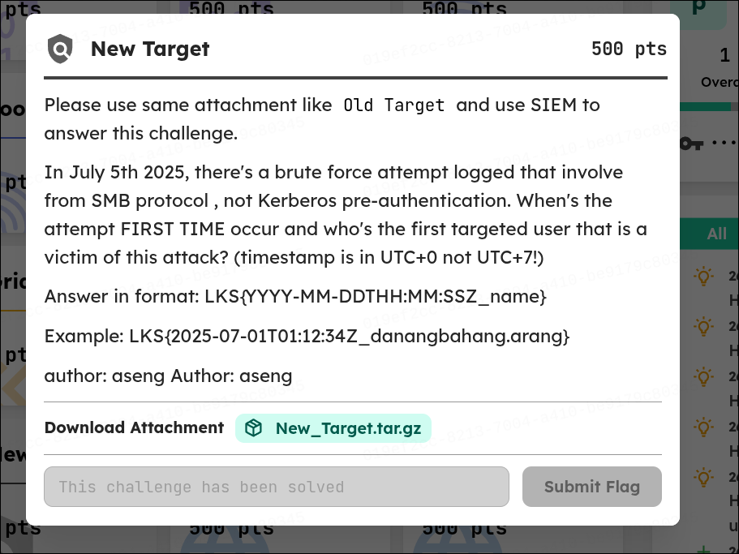
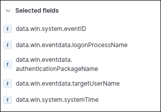

# WriteUp - New Target

## Overview

* **Name:** New Target
* **Category:** SIEM
* **Point:** 500
* **Author:** aseng
* **Desc:** 
````
Please use same attachment like Old Target and use SIEM to answer this challenge.

In July 5th 2025, there's a brute force attempt logged that involve from SMB protocol , not Kerberos pre-authentication. When's the attempt FIRST TIME occur and who's the first targeted user that is a victim of this attack? (timestamp is in UTC+0 not UTC+7!)

Answer in format: LKS{YYYY-MM-DDTHH:MM:SSZ_name}

Example: LKS{2025-07-01T01:12:34Z_danangbahang.arang}
````
* **File:** New_Target.tar.gz

## Summary

We can translate the descryption to SIEM query


````
In July 5th 2025, there's a brute force attempt logged that involve from SMB protocol , not Kerberos pre-authentication. When's the attempt FIRST TIME occur and who's the first targeted user that is a victim of this attack? (timestamp is in UTC+0 not UTC+7!)
````
* In July 5th 2025 there is Event ID 4625 (shows invalid login), which is brute-force do much of failure this is will lead us to known the answer of the question above. And there use NOT Kerberos then the question leads us to first user againts brute-force.

Search Field:
> 

Filter:
> 

## Analysis Idea

<b>FLAG:
----
LKS{2025-07-05T07:26:07Z_daya.aili}
</b>
